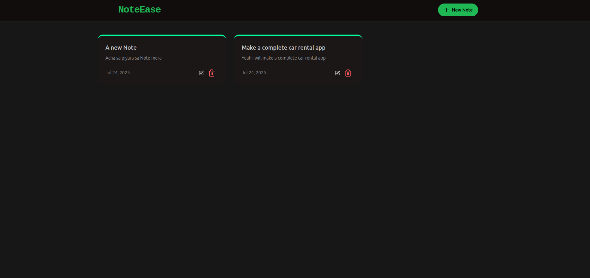
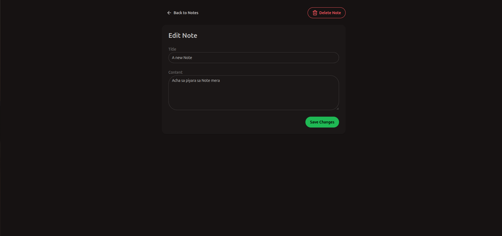

# 📝 NoteEase

A modern, full-stack note-taking application built with the MERN stack. Create, view, and manage your notes with a clean UI and robust backend.

[](https://noteease-production.up.railway.app/)

---

## 🚀 Features

-   ✍️ Create, edit, and delete notes
-   🔍 View note details
-   ⚡ Fast and responsive UI
-   🛡️ Rate limiting for security
-   🌙 Dark mode (if implemented)
-   📱 Mobile-friendly design

---

## 🖼️ Screenshots





<!-- Example for another image: -->
<!--  -->

---

## 🛠️ Tech Stack

**Frontend:**

-   React
-   Vite
-   Tailwind CSS

**Backend:**

-   Node.js
-   Express.js
-   MongoDB (with Mongoose)
-   Upstash (for rate limiting)

**Other:**

-   Axios (API requests)
-   Railway (Deployment)

---

## 📦 Project Structure

```
Mern-NoteTaking/
  ├── backend/
  │   ├── src/
  │   │   ├── app.js
  │   │   ├── config/
  │   │   ├── controllers/
  │   │   ├── middleware/
  │   │   ├── models/
  │   │   └── routes/
  ├── front-end/
  │   ├── src/
  │   │   ├── components/
  │   │   ├── Pages/
  │   │   ├── utils/
  │   │   └── assets/
  │   ├── public/
  │   └── index.html
  └── ...
```

---

## 🏁 Getting Started

### 1. Clone the repository

```bash
git clone https://github.com/your-username/Mern-NoteTaking.git
cd Mern-NoteTaking
```

### 2. Install dependencies

**Backend:**

```bash
cd backend
npm install
```

**Frontend:**

```bash
cd ../front-end
npm install
```

### 3. Set up environment variables

-   Create a `.env` file in `backend/` for MongoDB URI and any secrets.

### 4. Run locally

**Backend:**

```bash
npm run dev
```

**Frontend:**

```bash
npm run dev
```

---

## 🌐 Deployment

The app is deployed at:  
👉 [https://noteease-production.up.railway.app/](https://noteease-production.up.railway.app/)

---

## 🤝 Contributing

Pull requests are welcome! For major changes, please open an issue first to discuss what you would like to change.

---

## 📄 License

[MIT](LICENSE)

---

## 📷 How to Add Images

1. Place your image in `front-end/public/` or `front-end/src/assets/`.
2. Reference it in the README:
    - For `public/`:  
      ``
    - For `assets/`:  
      ``
3. Adjust the path if your README is at the root.

---

> _Built with ❤️ by Muhammad Umair and contributors._
